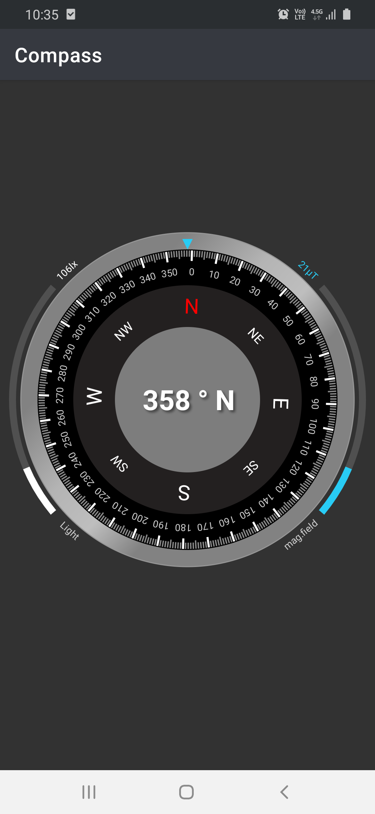
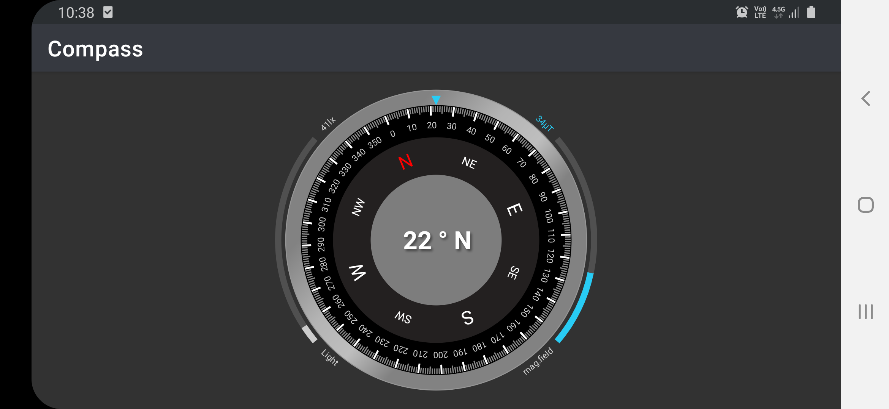

# 🧭 Elegant scalable percentage based Compass drawn using relative and real screen values

## About
Elegant Compass View that uses percentage instead of fixed values to draw components to have
similar scales in both portrait and landscape orientations.

| Portrait      | Landscape   |
| ----------|-----------|
|  |  |